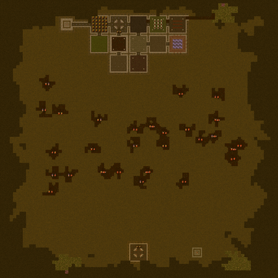
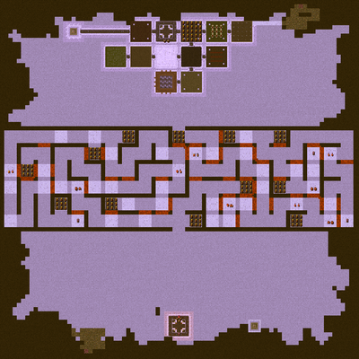

# dk-mage: **D**ungeon **K**eeper **MA**p **GE**nerator

Generate maps Dungeon Keeper 1 PC game.

## Generated map types

Following map types cam be generated:
- *cave*
- *maze*

## Running generator

Before first run open and edit `config.ini` file placed along main executable. Inside the file fill required variables (paths to game directories).

For simple generation just execute `dkmagecli` to generate random map. Generated map will be stored in game's directory ready to play from within `Free Play levels` game's menu. For advanced use of generator execute `dkmagecli --help`.

## Building under Linux

Following packages are required to build application under Linux:
- *g++-mingw-w64-i686*
- *gcc-mingw-w64-i686*
- *binutils-mingw-w64-i686*
They can be installed by following command `sudo apt install g++-mingw-w64-i686 gcc-mingw-w64-i686 binutils-mingw-w64-i686`.

Moreover compiler have to support *C++17* standard.

To generate build system execute one of scripts placed in `./configure` directory. It will create proper folder in `build` directory.
For example calling `./configure/lin_release_gcc.sh` will create `build/lin_release_gcc` directory. To build the application then go to `build/lin_release_gcc` and run `make`.

## Examples of various used techniques:

- *CMake*'s `FetchContent` and proper configuration for `add_directory` (`target_include_directories`)

## References:

- Mapmaker's Documentation: (https://lubiki.keeperklan.com/dk1_docs/)
- description of Dungeon Keeper data formats: (https://jonskeet.uk/dk/index.html)
- ADiKtEd editor: (https://github.com/dkfans/ADiKtEd)
- maps and tools: (https://lubiki.keeperklan.com/index.php)
- KeeperFX: (https://github.com/dkfans/keeperfx)
- generation of caves: (http://roguebasin.roguelikedevelopment.org/index.php?title=Cellular_Automata_Method_for_Generating_Random_Cave-Like_Levels)
- Dungeon Keeper 2 mapper: (https://www.killerbeesoftware.com/dk2/)
- Diablo map generator explained: (https://www.boristhebrave.com/2019/07/14/dungeon-generation-in-diablo-1/)

### Various libraries
- TCLAP library: (http://tclap.sourceforge.net/)
