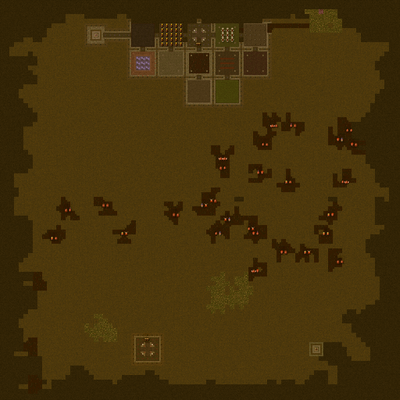

# dk-mage: **D**ungeon **K**eeper **MA**p **GE**nerator

Generate maps for Dungeon Keeper 1 PC game.

## Generated map types

Following map types can be generated:
- *cave* -- open area with chambers in center with hidden enemy creatures ([sample](doc/samples/cave.zip))
- *maze* -- big maze in center of map with hidden trasures and traps ([sample](doc/samples/maze.zip))
- *herofortress* -- siege of hero fortress ([sample](doc/samples/herofortress.zip))
- *random* -- randomly picks one of modes described above

Following previews and samples were generated with *Sample* seed:

## Running generator

Before first run edit `config.ini` placed along main executable. Inside the file fill required variables (paths to game directories).

For simple generation just execute `dkmagecli` to generate random map. Generated map will be stored in `level_path` defined in config. If the path is game's directory then map will be ready to play from within `Free Play levels` game's menu. For advanced use of generator execute `dkmagecli --help` or open [dkmagecli help](doc/dkmagecli-help.md) description.

### Processing generator parameters

Generator parameters can be passed by command line argument or by configuration file. Processing sequence of parameters:
1. load `config.ini` from file passed by command line argument `--config`, if no cmd argument given then use default location
2. load all parameters from `general` section of configuration file
3. load all parameters from type section pointed by `--type` command line argument or `type` from `general` section
4. overwrite loaded parameters by arguments passed through command line (if any)

Processing sequence defines following priority of parameters (from most to least important):
1. command line parameters
2. type section from configuration file
3. `general` section from configuration file
4. default values if no parameters set

There are few exceptions from priority rule described above:
- `config` parameter is only read from command line
- `seed` parameter is only read from command line or `general` section from configuration file
- `type` parameter is only read from command line or `general` section from configuration file

## Building under Linux (including WLS)

To generate build system execute one of scripts placed in `configure` directory. It will create proper folder in `build` directory.
For example calling `configure/lin_release_gcc.sh` will create `build/lin_release_gcc` directory. To build the application then go to `build/lin_release_gcc` and run `make`.

It is also possible to configure prepare customized build by using `cmake` directly.

### Linux target

To build Linux executables run `configure/lin_release_gcc.sh` or `configure/lin_debug_gcc.sh` scripts then run `make` in proper subdirectory in `build`.

Following packages are required to proceed with build: 
- *cmake*
- *gcc*
- *g++*

They can be installed by following command `sudo apt install cmake g++ gcc`.

### Windows target

To build Windows executables run `configure/win_release_gcc.sh` or `configure/win_debug_gcc.sh` scripts then run `make` in proper subdirectory in `build`.

Following packages are required to build application under Linux for Windows platform:
- *g++-mingw-w64-i686*
- *gcc-mingw-w64-i686*
- *binutils-mingw-w64-i686*

They can be installed by following command `sudo apt install g++-mingw-w64-i686 gcc-mingw-w64-i686 binutils-mingw-w64-i686`.

### running unit tests

Unit tests can be executed from within proper `build` subdirectory by executing `ctest` command.

## Building under other platforms

To build one have to `cmake` directly in order to configure project and then execute `cmake --build .` from within configured build directory.

## Examples of various used techniques:

- *CMake*'s `FetchContent` and proper configuration for `add_directory` (`target_include_directories`)

## References:

- Mapmaker's Documentation (https://lubiki.keeperklan.com/dk1_docs/)
- description of Dungeon Keeper data formats (https://jonskeet.uk/dk/index.html)
- ADiKtEd editor (https://github.com/dkfans/ADiKtEd)
- maps and tools (https://lubiki.keeperklan.com/index.php)
- KeeperFX (https://github.com/dkfans/keeperfx)
- generation of caves (http://roguebasin.roguelikedevelopment.org/index.php?title=Cellular_Automata_Method_for_Generating_Random_Cave-Like_Levels)
- Dungeon Keeper 2 mapper (https://www.killerbeesoftware.com/dk2/)
- Diablo map generator explained (https://www.boristhebrave.com/2019/07/14/dungeon-generation-in-diablo-1/)

### external libraries
- ADiKtEd: handling DK's file formats (https://github.com/dkfans/ADiKtEd)
- filesystem: pre C++17 `std::filesystem` compatible implementation (https://github.com/gulrak/filesystem)
- LEMON: graphs implementation (https://lemon.cs.elte.hu)
- TCLAP: command line args processing (http://tclap.sourceforge.net/)
- inih: INI files parser (https://github.com/jtilly/inih)
- Catch2: testing framework for unit-tests (https://github.com/catchorg/Catch2)
